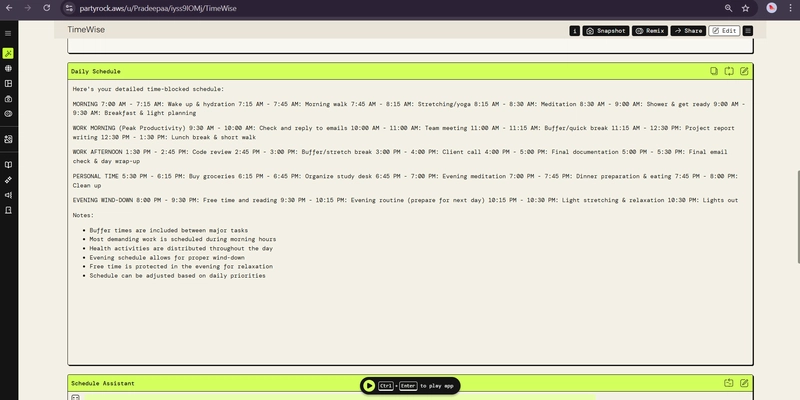

# 🚀 Daily Task Scheduler Assistant

An AI-powered productivity and task management assistant built using AWS PartyRock and Amazon Bedrock. The application helps users organize daily activities, prioritize tasks, manage deadlines, and improve productivity through intelligent scheduling recommendations.

## 🌐 Live Demo

[Launch Application](https://partyrock.aws/u/ak2765/4SmuJqdNP/Daily-Task-Scheduler-Assistant)

---

## 📖 Project Overview

Daily Task Scheduler Assistant is a cloud-based AI application designed to help students, professionals, and freelancers efficiently plan and manage their daily activities. Using Generative AI, the system provides recommendations for task prioritization, scheduling, and productivity improvement.

This project was developed using AWS PartyRock as part of an AWS Generative AI learning initiative.

---

## ✨ Core Features

- ✅ Task Creation and Management
- ✅ Task Prioritization (High, Medium, Low)
- ✅ Due Date and Time Scheduling
- ✅ Recurring Task Support
- ✅ Smart Reminders and Notifications
- ✅ Calendar-Based Planning
- ✅ Daily Progress Tracking
- ✅ AI-Powered Schedule Generation
- ✅ Productivity Recommendations
- ✅ Dashboard for Today's and Upcoming Tasks

---

## 🎯 Target Users

- Students
- College Students
- GATE / UPSC Aspirants
- Working Professionals
- Freelancers
- Entrepreneurs
- Productivity Enthusiasts

---

## ☁️ AWS Services & Technologies

### AWS Services

- AWS PartyRock
- Amazon Bedrock
- Amazon Cognito
- Amazon DynamoDB
- Amazon SNS
- Amazon S3
- AWS Amplify
- Amazon CloudWatch

### Development Stack

- React.js
- Node.js
- Express.js
- HTML5
- CSS3
- JavaScript

---

## 🏗️ Proposed Cloud Architecture

```text
User
 │
 ▼
AWS PartyRock Interface
 │
 ▼
Amazon Bedrock
 │
 ▼
Task Analysis Engine
 │
 ▼
Schedule Generator
 │
 ▼
AI Recommendations
```

---

## 📷 Project Snapshot

> Upload your screenshot as:

```text
docs/Screenshots/PartyRock_Snapshot.png
```

```markdown

```

---

## 📊 Expected Scale

| Metric | Value |
|----------|----------|
| Users | 50–500 |
| Daily Active Users | 20–200 |
| Tasks Per User | 5–50 |
| Concurrent Users | 10–50 |

---

## 🔒 Non-Functional Requirements

- Secure Authentication
- Mobile Responsive Design
- Cloud-Based Deployment
- Fast Response Time (< 3 Seconds)
- Scalable Architecture
- Secure Data Storage
- High Availability

---

## 🚀 Future Enhancements

- Mobile Application
- Google Calendar Integration
- Voice-Based Task Management
- AI Time Estimation
- Team Collaboration Features
- Advanced Analytics Dashboard
- Email & SMS Notifications
- Multi-Language Support

---


## 📚 Learning Outcomes

- AWS PartyRock Development
- Generative AI Applications
- Cloud Architecture Design
- Productivity Management Systems
- AWS Service Integration
- AI-Based Task Scheduling

---

## 👨‍💻 Author

**Animesh Keche**

Bachelor of Engineering (Computer Engineering)

GitHub: https://github.com/animeshkeche

---

## ⭐ Support

If you found this project useful, consider giving it a star ⭐